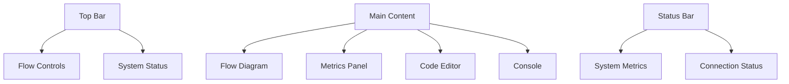
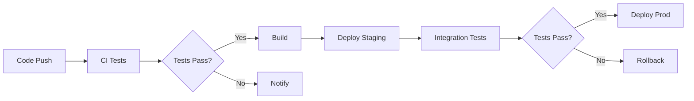

# Flow Control System Documentation

## System Overview

The Flow Control system is a comprehensive development environment for creating, testing, and managing data flow pipelines. It combines a powerful Go backend with a modern web interface and robust shell-based testing infrastructure.

### Core Architecture

#### 1. Backend Components (Go)
```
/cmd
  /flowcontrol     # Entry point
/internal
  /server         # HTTP, SSE, routing
  /flow           # Flow management
  /parser         # Custom syntax
  /store          # Database
  /metrics        # Metrics collection
  /logger         # Logging system
  /config         # Configuration
/pkg             # Reusable packages
/web
  /templates      # HTML (htmx)
  /static         # Assets
/tests           # Integration tests
```

#### 2. Shell Infrastructure
```
scripts/
├── lib/
│   ├── core/
│   │   ├── progress.sh     # Progress tracking
│   │   ├── logging.sh      # Logging system
│   │   ├── platform_state.sh # Platform detection
│   │   └── config_base.sh  # Base configuration
│   ├── docker/
│   │   └── docker.sh       # Docker management
│   └── config/
│       └── docker_config.sh # Docker configuration
├── test/
│   ├── L0_visual/         # Visual feedback tests
│   ├── L1_core/          # Platform tests
│   ├── L2_environment/   # Environment tests
│   └── framework.sh      # Test framework
└── deploy/
    └── deploy.sh         # Deployment scripts
```

### Technology Stack

1. **Backend**
   - Go (core server)
   - Chi router (HTTP routing)
   - SQLite (database)
   - SSE (real-time updates)

2. **Frontend**
   - HTMX (dynamic updates)
   - TailwindCSS (styling)
   - Monaco Editor (code editing)
   - Mermaid.js (flow visualization)

3. **Testing**
   - Shell-based test framework
   - Multi-level test hierarchy
   - Visual regression testing
   - Environment validation

4. **Infrastructure**
   - Docker (containerization)
   - Make (build system)
   - Shell scripts (automation)
   - GitHub Actions (CI/CD)

## Implementation Details

### 1. Progress System

The progress tracking system provides visual feedback for operations:

```bash
# Status indicators
✅ Success
❌ Error
⚠️ Warning
ℹ️ Info

# Progress bar
[===>    ] 45%

# Spinner for background tasks
⠋ Processing...
```

### 2. Test Framework

#### Hierarchy
1. **L0 (Visual Tests)**
   - UI component validation
   - Progress indicator verification
   - Terminal compatibility
   - Color scheme validation

2. **L1 (Platform Tests)**
   - Shell compatibility (zsh/bash)
   - OS feature detection
   - Command availability
   - Permission handling

3. **L2 (Environment Tests)**
   - Docker system validation
   - Network configuration
   - Volume management
   - Resource allocation

4. **L3 (Operation Tests)**
   - End-to-end workflows
   - Integration scenarios
   - Performance metrics
   - Recovery procedures

### 3. UI Components



#### Layout Structure
```html
<div class="layout">
  <div class="top-bar">
    <!-- Controls -->
  </div>
  <div class="main-content">
    <div class="left-panel">
      <!-- Flow diagram -->
      <!-- Metrics -->
    </div>
    <div class="right-panel">
      <!-- Code editor -->
      <!-- Console -->
    </div>
  </div>
  <div class="status-bar">
    <!-- System status -->
  </div>
</div>
```

### 4. Real-time Updates

SSE endpoints for live updates:
```
/events/flows/{id}/status  - Flow status
/events/flows/{id}/metrics - Metrics
/events/flows/{id}/logs    - Logging
/events/flows/{id}/diagram - Visualization
```

## Development Workflow

### 1. Local Development

```bash
# Start development environment
make dev

# Run tests
make test-all
make test-visual
make test-platform
make test-environment

# Build system
make build

# Deploy
make deploy ENV=staging
```

### 2. Testing Process

1. **Visual Tests**
   ```bash
   make test-visual
   # Validates:
   # - Progress indicators
   # - Color schemes
   # - Terminal compatibility
   ```

2. **Platform Tests**
   ```bash
   make test-platform
   # Checks:
   # - Shell compatibility
   # - OS features
   # - Command availability
   ```

3. **Environment Tests**
   ```bash
   make test-environment
   # Verifies:
   # - Docker setup
   # - Network config
   # - Resource allocation
   ```

### 3. Deployment Pipeline



## Current Status

### Completed
- ✅ Core shell infrastructure
- ✅ Test framework implementation
- ✅ Basic UI components
- ✅ Progress tracking system
- ✅ Platform detection
- ✅ Docker integration
- ✅ Make-based build system

### In Progress
- 🔄 L2 environment tests
- 🔄 Enhanced visual feedback
- 🔄 Real-time updates
- 🔄 Flow visualization
- 🔄 Error handling improvements

### Planned
- 📋 L3 operation tests
- 📋 Performance monitoring
- 📋 Advanced recovery
- 📋 Metrics collection
- 📋 Configuration management

## Best Practices

### 1. Code Structure
- Modular shell scripts
- Clear dependency chain
- Comprehensive error handling
- Detailed logging

### 2. Testing
- Isolated test environments
- Comprehensive coverage
- Visual regression testing
- Performance benchmarks

### 3. Documentation
- Inline code comments
- API documentation
- Architecture diagrams
- User guides

### 4. Security
- Environment isolation
- Secure defaults
- Access control
- Audit logging

## Recovery Strategies

### 1. System Issues
- Automatic state detection
- Graceful degradation
- Self-healing mechanisms
- Detailed error reporting

### 2. Docker Problems
- Container health checks
- Automatic restart
- Resource cleanup
- State preservation

### 3. Network Issues
- Connection retry
- Timeout handling
- Fallback mechanisms
- Status monitoring

## Future Roadmap

### Phase 1 (Current)
- Complete test framework
- Implement all test levels
- Enhance visual feedback
- Stabilize core features

### Phase 2 (Next)
- Advanced flow visualization
- Real-time collaboration
- Custom node types
- Enhanced monitoring

### Phase 3 (Future)
- Machine learning integration
- Automated optimization
- Distributed processing
- Custom extensions

## Quick Reference

### Common Commands
```bash
# Development
make dev              # Start development
make test            # Run all tests
make build           # Build system
make deploy          # Deploy system

# Testing
make test-visual     # UI tests
make test-platform   # OS tests
make test-environment # Env tests

# Debugging
make debug          # Debug mode
make logs           # View logs
make status         # System status
```

### Directory Structure
```
flow-control/
├── cmd/             # Entry points
├── internal/        # Core logic
├── pkg/            # Shared packages
├── scripts/        # Shell scripts
├── tests/          # Test suites
├── web/            # Frontend
└── Makefile        # Build system
```